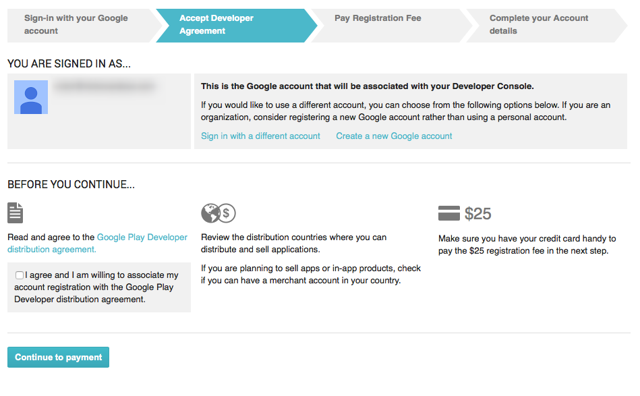
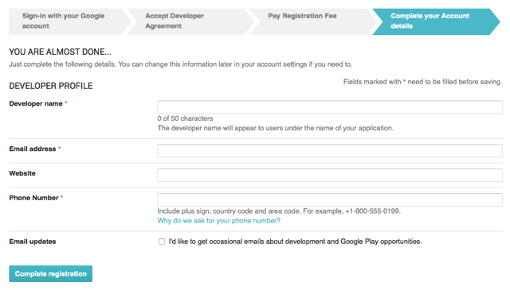
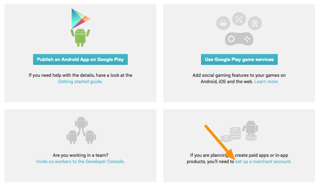
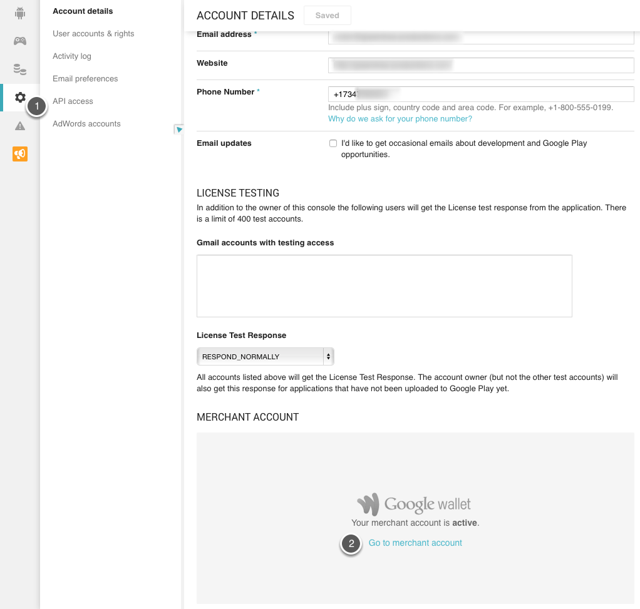

# Creating a Google Play Developer Account

1.  Navigate to https://play.google.com/apps/publish/signup/

2.  Read and agree to the Google Play Developer Distribution agreement.

3.  Pay the registration fee for your account.

4.  Fill out your Google Play Developer profile.

5.  (Optional) If you plan to create paid apps or have in-app purchases for products, set-up a merchant account.

6.  Go to Settings (Label 1) > Merchant Account to access a link to go back to your Merchant Account (Label 2).

7.  In the Wallet Merchant Center, go to Settings (Label 1) > Sales Tax (Label 2) and fill out the appropriate details.
Important Information

    *  It is vital to set-up the proper sales tax for the geographic regions where you will sell your app. You can learn more about sales tax settings by reading the Google Help article on charging sales tax.

[Home](../../README.md)
