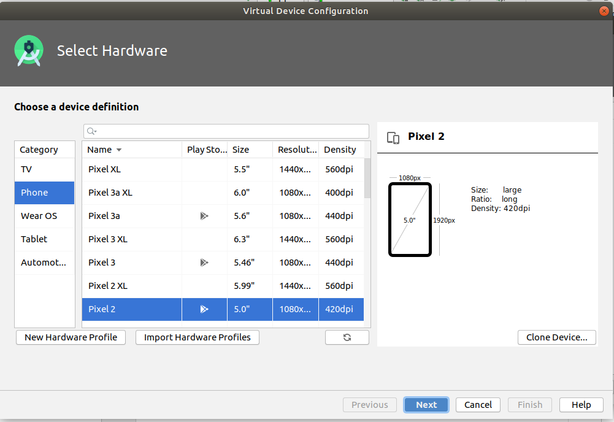
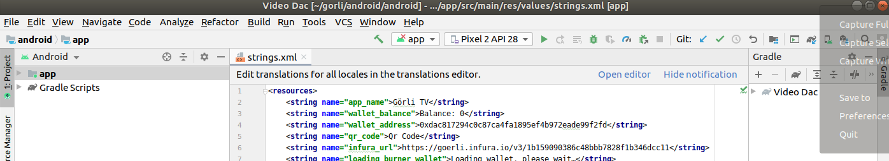

# Building and Releasing the APK 

1.  Go to Tools>AVD Manager to create an android virtual device.

2.  Click "Create Virtual Device" and choose a preselected device profile.  The default is a Pixel 2 which will work fine and click next.

3.  Select a version of Android or Android API and choose download:

4.  The device image will take some time to download, when it is complete click "Finish":

5.  Click "Next" on the system image dialogue. 

6.  On the following screen set the default device orientation to "Landscape" and select ok.  You will see a list of your virtual devices.  In this area you can configure multiple virtual devices for debugging: 

7.  Close the virtual device manager and on the main page of Android Studio, set the drop down at the top to the device you just configured and click on the "Play" (Green Aarow) icon: 

8.  After a few minutes the emulated device should appear and the app will start with a message stating that the install was successful: 

9.  In the main window of Android Studio go to Build>Build Variant which will open a pane in the lower left corner of the window.  Here click on the "Active Build Variant" field and change it to "Release":

10.  To output a signed APK to your computer for release, go to `Build>Generate Signed Bundle / APK`, then select "APK" then click "Next"

11.  Then, select "Create new" to create a new key for signing the APK file.

12.  Choose a place to store your keystore file, and passwords to secure the files and keys.

13.  Select "Next" to confirm the use of your new signing key

14.  Choose `release` from the options, ticking **both boxes for V1 and V2 signing**, and click "Finish"

15.  When complete, you can locate or analyze the APK by selecting one of those options on the little notification in the lower right hand side of the screen :)

16. You now have an `apk` file, signed by your own key, which you can use to publish to Google Play.

[Home](../../README.md)
