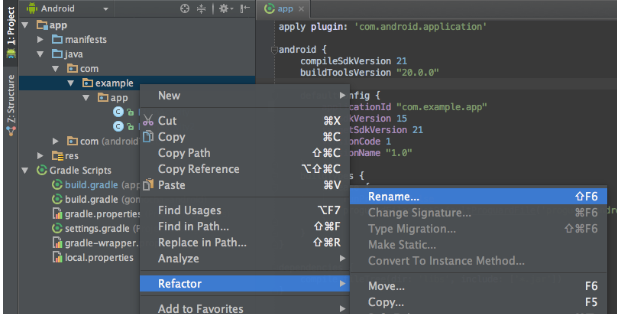

# Building and Releasing the APK 

1.  The package name and versioning will need to be changed prior to generating the APK.

2.  In the project pane click the gear icon and uncheck "Compact Empty Middle Packages" option.

3.  Expand the Java folder, expand the com folder and right click on the folder after com.  It should be called com.videodac.  Select "refactor" and select "rename."

4.  Choose "Rename Package"

5.  Enter the new name (no com.  just the name  ex: videodacnew) and click ok.

6.  Click "Do refactor" in the bottom window pane.

7.  Open the gradle build file (build.gradle) and change the app name to the be identical to the new app name in the manifest.  Also change the versioncode to 1 and version name to 1.0

8.  Debug the application and there will be a build error for google services.  Select this json file that the build error gives you.  Change the application name in that file to match the new name.

9.  Debug the application again to make sure it builds correctly.

 To output a signed APK to your computer for release, go to `Build>Generate Signed Bundle / APK`, then select "APK" then click "Next"

10.  Then, select "Create new" to create a new key for signing the APK file.

11.  Choose a place to store your keystore file, and passwords to secure the files and keys.

12.  Select "Next" to confirm the use of your new signing key

13.  Choose `release` from the options, ticking **both boxes for V1 and V2 signing**, and click "Finish"

14.  When complete, you can locate or analyze the APK by selecting one of those options on the little notification in the lower right hand side of the screen :)

15. You now have an `apk` file, signed by your own key, which you can use to publish to Google Play.

[Home](../../README.md)

