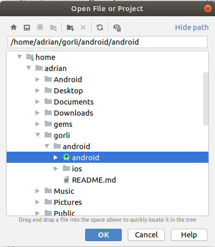
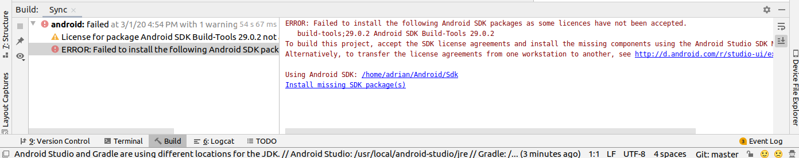
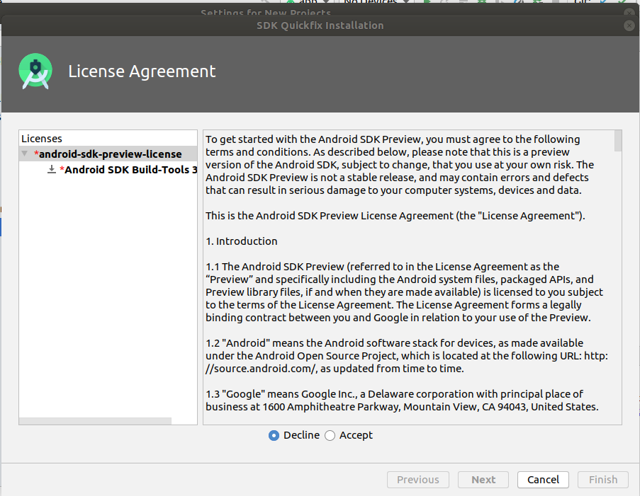

# Import the App to Android Studio

Please note:  These instructions are not all inclusive of possible import errors that can occur, however, it does cover an example of needing to accept software licenses to install missing libraries. Please refer to https://developer.android.com/studio/intro/update.html#download-with-gradle for any issues relating to the gradle sync or needing to update IDE / SDK tools.

1.  With Android Studio open, select "Import Project (Gradle, Eclipse ADT, etc.)":

2.  In your home directory, find the Acme directory you created, expand it, expand the android folder, and select the android option with the Android Studio logo next to it.  Click "OK":

3.  In the new window that opens you can watch the Gradle sync happen at the bottom row of the window.  Allow it to download all the required dependencies.  This may take several minutes.

4.  Android studio may ask you to update your version of Gradle. This will be a small window notification in the lower right hand corner of the screen.  Proceed to upgrade.  Gradle is up-to-date, you will see this in your screen:

5.  If there are any license issues from not accepting the terms, you will see this at the bottom of the window: 

6.  Go to Tools > SDK Manager and the following screen will pop up where you can select  "SDK Tools" and "Android SDK Build-Tools"

7.  Select "Show Package Details" at the bottom of this window.  Select the Android SDK Build Tool version that the error message is showing and then click "Apply":

8. Accept the terms of the license and click "OK" to proceed with the missing package installation.

9.  Click "Finish" when the component installer is done.  

10.  Go to File > Close project

11.  Repeat steps one and two and when the project is imported successfully, you will be at this window: 

[Home](../../README.md)
