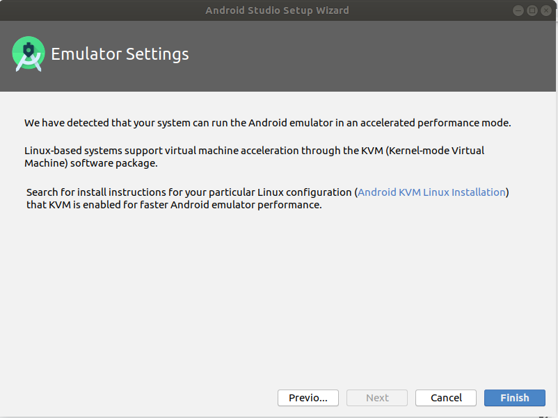
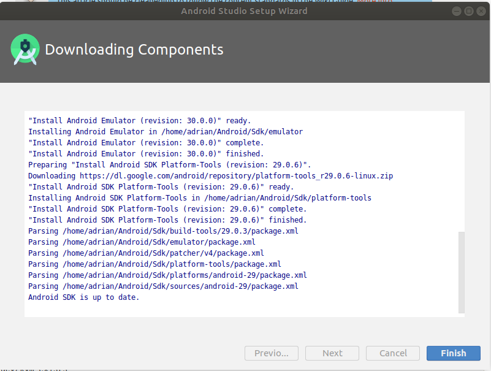
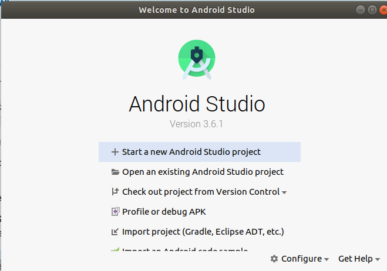

# Install Android Studio

1.  Proceed to https://developer.android.com/studio and download Android Studio.

2.  In a terminal window, change directories to wherever the installation .tar.gz file is located, in this example it is in the Downloads folder:

    ```
    $ cd Downloads
    ````

3.  If you are installing for just your profile follow step 3a. to unpack the tar.gz file.  If you are installing for shared users follow step 3b:

    3a. Single user install:

        ```
        $ tar xf android-studio-ide-192.6241897-linux.tar.gz
        $ sudo mv android-studio /usr/local/android-studio
        ```
    
    3b. Shared user install: 

        ```
        $ tar xf android-studio-ide-192.6241897-linux.tar.gz
        $ sudo mv android-studio /opt/android-studio
        ```

4.  Change directories to android-studio/bin/ directory, in this case it is a single user install: 

    ``` 
    $ cd /usr/local/android-studio/bin
    ```

5.  Execute the studio.sh file: 

    ```
    $ ./studio.sh
    ```

6.  You can choose a Config or installation folder (for advanced users) but for this tutorial we will select "Do not import settings" and click OK.


7.  Select your preference to data-share with Google for user experience improvements.

8.  The Android Studio Setup Wizard will appear, click "Next":


9.  On the following screen choose "Standard" and click "Next":


10.  Choose your preferred UI theme (Darcula or Light) and click "Next":

11.  The next screen allows you to review the installation settings, click "Next":


12.  If you are notified that your system can run the Android emulator in accelerated mode, follow steps 14-20 to install KVM, otherwise skip to step 21.  (Installing KVM improves performance of any virtual device you are using for debugging.)



13.  When you are notified about downloading components, click "Finish":



14.  Check and install virtualization acceleration:

15. Open a new terminal window and install CPU checker:

        ```
        $ sudo apt install cpu-checker
        ```

16.  Verify that KVM acceleration can be used: 

        ```
        $ kvm-ok
        ```
17.  Will output:  

        ```
        INFO: /dev/kvm exists
        KVM acceleration can be used
        ```

18.  Use the following command to install KVM: 

        ```
        $ sudo apt-get install qemu-kvm libvirt-bin ubuntu-vm-builder bridge-utils
        ```

19.  Add the current user to the KVM group

        ```
        $ sudo adduser $USER kvm

20.  Restart your computer and proceed to reopen Android studio:

        ```
        $ cd /usr/local/android-studio/bin
        $ ./studio.sh
        ```

21.  The installation will be finished and the following screen will appear (Note: Go to "Configure" and select "Create Desktop Entry" to add an Icon to your list of applications).



[Home](../../README.md)


