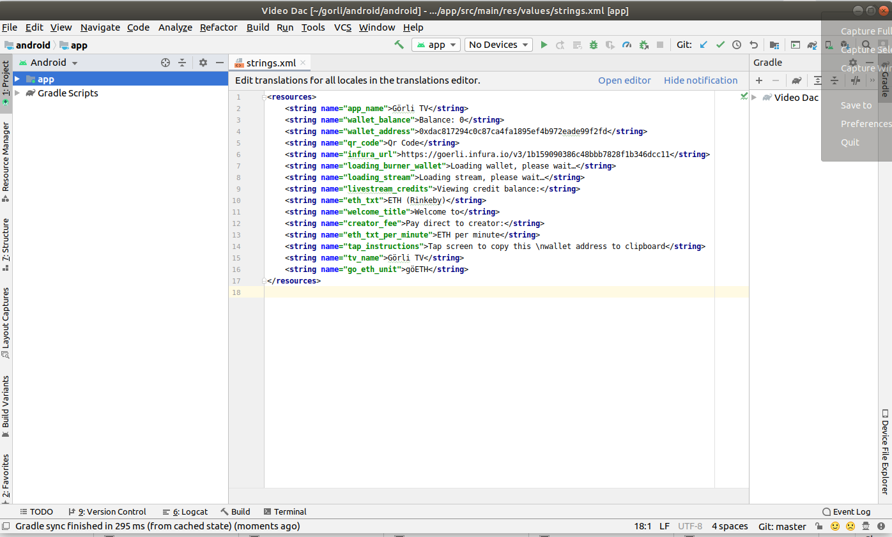

# Setting Key Variables

* App name (e.g. Acme TV)
* Pay-to address
* Network, from rinkeby, goerli, ropsten, kovan, mainnet, or a    custom RPC URL
* price-per-minute in network's native ETH

You have imported the App and you are at the following screen where these variables can be set: 

* To set the streaming fee and recipient address, modify the lines 21 & 22 in `helpers/Utils.kt` and set the variables `streamingFeeInEth` & `recipientAddress`

* App name can be set in the "app_name" field.
* Pay-to address can be set in the "wallet_address" field.
* You must set the "infura_url" to choose  a network, or this is where you would enter a custom RPC URL.

    * To get an infura_rul proceed to https://infura.io and create an account.
    * Create a new project. 
    * You can name the project, and then under keys select the endpoint to be the Ethereum network you wish to use.
    * Copy the link that is generated and paste it in the "infura_url" field of the configuration.

* Change the "eth_txt" field to reflect the correct network selection.

* Save the file.

[Home](../../README.md)

